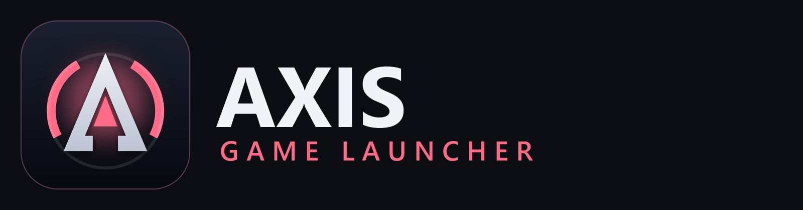

# Axis Game Launcher

A Windows launcher that gathers the games from your installed launchers (Steam, Epic, GOG, Xbox, EA app,
Ubisoft Connect, Battle.net, Rockstar, Amazon Games) and any folders you add into one library.

## Install

1. Download `GameLauncher-Setup.exe` from the latest release on the GitHub **Releases** page.
2. Run it and follow the wizard. No administrator rights are needed.
3. Updates are delivered inside the app.

### "Windows protected your PC" (SmartScreen)

The installer is not code-signed, and a new download has no reputation with Microsoft yet, so Windows
SmartScreen may show a blue **Windows protected your PC** screen the first time you run it. This is
expected for unsigned apps and does not by itself mean the file is unsafe.

To continue:

1. Click **More info**.
2. Click **Run anyway**.

You only need to do this once per downloaded file. If you would rather check the file first, you can scan
it with Windows Security or upload it to a scanner of your choice before running it.

Your library and settings are stored in `%AppData%\GameLauncher`, separate from the program files, so
reinstalling or updating does not touch them.
